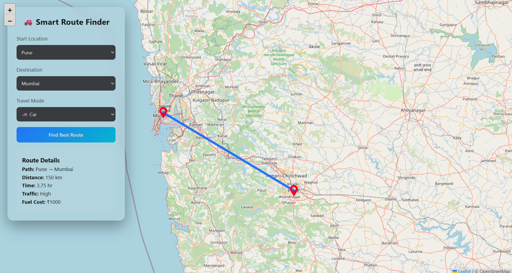
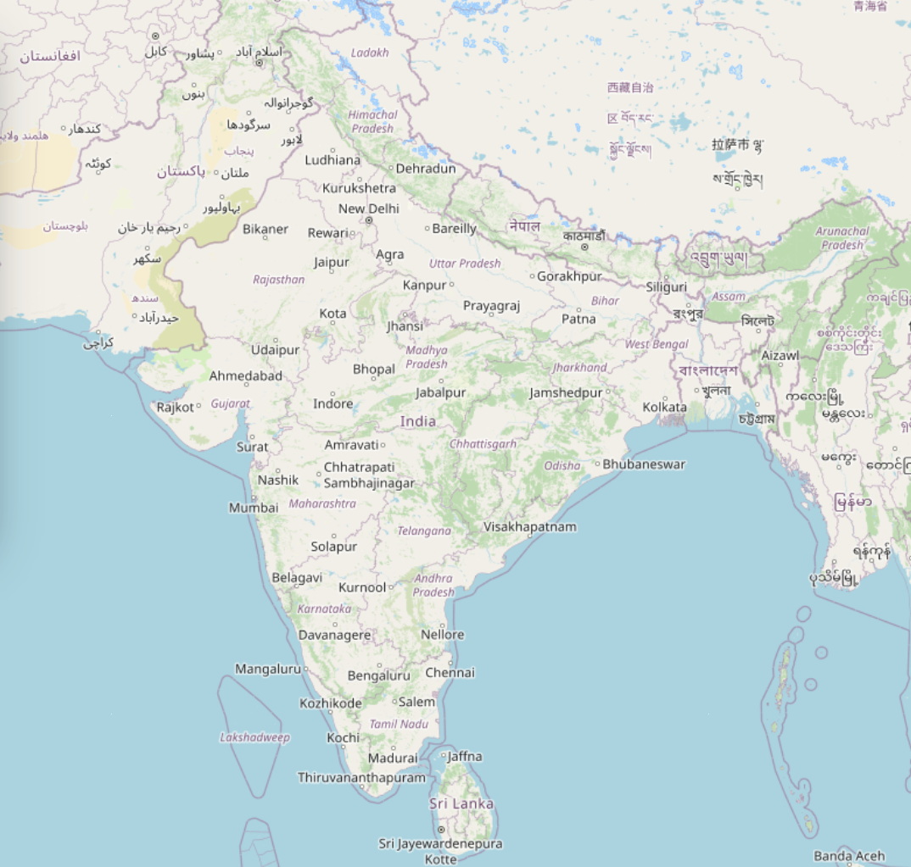

# 🚗 Smart Route Finder

A web-based **Smart Route Finder** that calculates the shortest route between cities using the **Dijkstra Algorithm** and visualizes it on an interactive map.

This project demonstrates the practical application of **graph algorithms, web development, and map visualization** to solve real-world navigation problems.

---

## 📌 Features

✔ Shortest path calculation using **Dijkstra Algorithm**  
✔ Interactive **OpenStreetMap visualization**  
✔ Travel mode selection (Car, Bike, Walking)  
✔ **Traffic simulation** affecting travel time  
✔ **Fuel cost estimation**  
✔ Clean and modern user interface  

---

## 🧠 Algorithm Used

This project uses the **Dijkstra Shortest Path Algorithm**.

The algorithm works by:

1. Representing cities as **nodes**
2. Roads as **edges with weights (distance)**
3. Finding the **minimum distance path** between start and destination

---

## 🛠 Technologies Used

### Backend
- Python
- Flask

### Frontend
- HTML
- CSS
- JavaScript

### Map Visualization
- Leaflet.js
- OpenStreetMap

### Algorithm
- Dijkstra Algorithm

---

## 📂 Project Structure

smart-route-finder
│
├── app.py
│
├── templates
│ └── index.html
│
├── static
│ ├── style.css
│ └── script.js
│
└── README.md

---

## 🖥 How to Run the Project

### 1️⃣ Clone the Repository

git clone https://github.com/yourusername/smart-route-finder.git

### 2️⃣ Navigate to Project Folder

cd smart-route-finder

### 3️⃣ Install Dependencies

pip install flask

### 4️⃣ Run the Application

python app.py

### 5️⃣ Open Browser

http://127.0.0.1:5000

---

## 📸 Screenshots

### Route Finder Interface

### Route Visualization on Map

---

## 📊 Example Output

Route: Pune → Nashik → Aurangabad

Distance: 210 km
Estimated Time: 3.5 hours
Traffic: Medium
Fuel Cost: ₹1400

---

## 🎯 Learning Outcomes

This project helped in understanding:

- Graph algorithms in real-world applications
- Backend development using Flask
- Frontend and backend communication
- Map visualization using Leaflet.js
- Basic project structuring for GitHub

---

## 🚀 Future Improvements

Possible future enhancements include:

- Real-time traffic data
- GPS-based location detection
- Integration with Google Maps API
- Mobile-friendly interface
- AI-based route prediction

---

## 👨‍💻 Author

**Rupesh Surve**

If you like this project, consider giving it a ⭐ on GitHub!